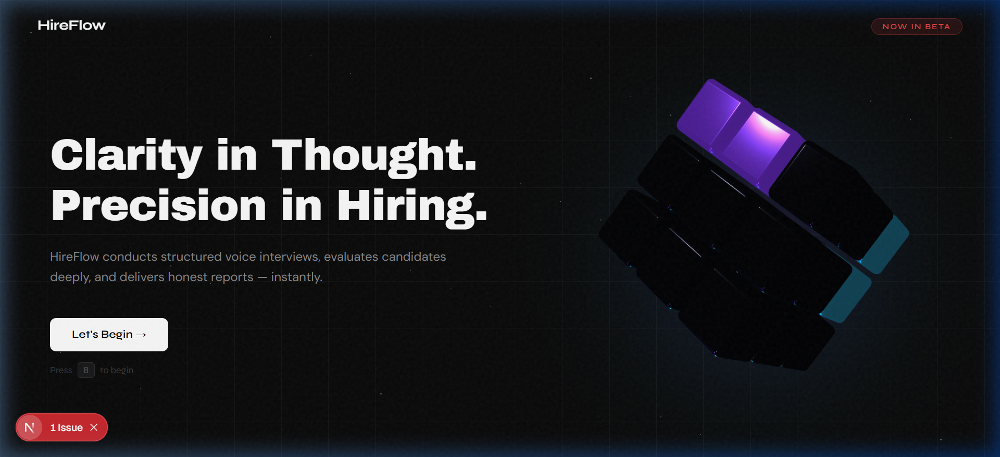
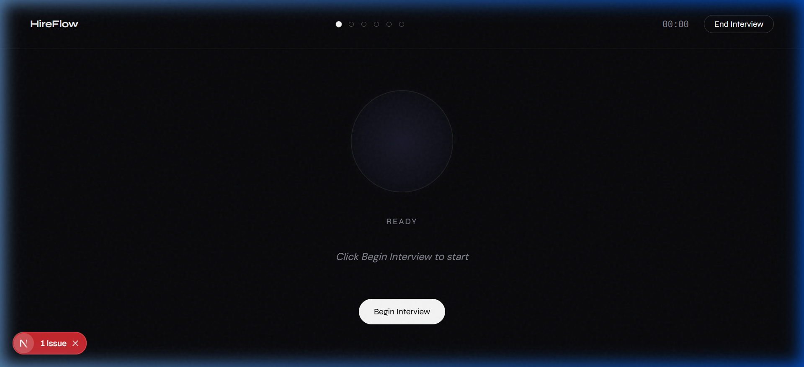
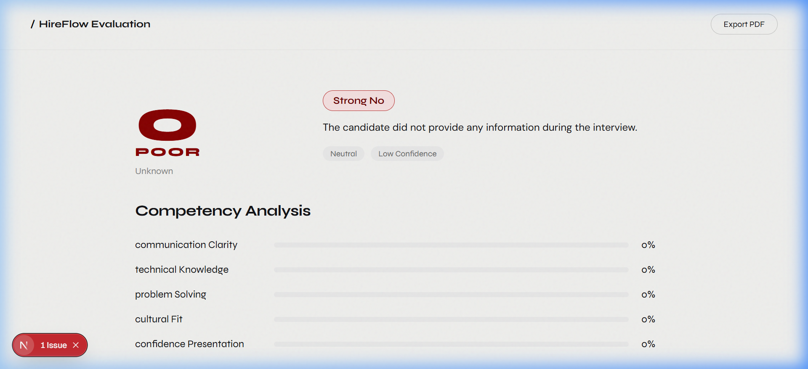

# HireFlow: The Autonomous Technical Interviewer



HireFlow is an advanced, AI-driven interview platform designed to conduct high-fidelity, voice-first technical screenings. It leverages state-of-the-art inference speeds and sophisticated LLM orchestration to provide a professional, seamless experience that mimics a senior technical lead.

## 🌟 Vision & Impact

In a world where recruitment bottlenecks delay innovation, HireFlow serves as the first line of technical assessment. By automating the preliminary screening process with a "State-Aware" AI agent, we allow human recruiters to focus on high-potential candidates while ensuring every applicant receives a fair, consistent, and deep technical evaluation.

## 🚀 Key Features

- **Voice-First Experience**: Near-instantaneous STT and TTS pipeline for natural, fluid conversations.
- **Dynamic 3D Interface**: An interactive, rounded Rubik's cube centerpiece that provides tactile feedback and visual engagement.
- **State-Machine Logic**: A structured 6-stage interview process (Intro, Experience, Stack, Logic, Behavioral, Closing).
- **Data-Driven Reports**: Detailed performance breakdowns, competency heatmaps, and sentiment analysis.
- **Strict Time Management**: Hard 15-minute limits to ensure efficiency and respect for candidate time.

## 📸 Interface Preview

### 1. The Interview Interface

*A minimalist, focused environment featuring the "Alex" persona and real-time voice activity detection.*

### 2. The Evaluation Report

*Deep-dive analysis including category scores, percentile rankings, and hiring recommendations.*

## 🛠️ The Technology Stack

- **Frontend**: [Next.js 16](https://nextjs.org/) (App Router) with [Framer Motion](https://www.framer.com/motion/) and [Three.js](https://threejs.org/).
- **Inference**: [Groq](https://groq.com/) (Llama-3.3-70b & Whisper-large-v3) for sub-500ms response times.
- **Voice**: [ElevenLabs](https://elevenlabs.io/) (Aarav - Indian English Professional).
- **Evaluation**: [Google Gemini 1.5 Pro](https://ai.google.dev/) for high-context transcript analysis.
- **Persistence**: [Supabase](https://supabase.com/) (PostgreSQL) for secure session storage.

## 🧠 Architectural Decisions

### Why we moved away from WebRTC (Livekit)
While Livekit is excellent for multi-user real-time rooms, technical interviews are inherently turn-based. We opted for a **High-Speed HTTP-Burst Architecture**. This approach:
- **Reduces Latency**: Bypassing signaling servers for direct inference calls.
- **Optimizes Cost**: You only pay for active processing, not persistent room uptime.
- **Enhances Reliability**: More resilient to minor network fluctuations common on mobile 4G/5G.

## ⚡ Setup & Installation

1. **Clone & Install**:
   ```bash
   git clone https://github.com/jyotirmya17/HireFlow.git
   cd hireflow
   npm install
   ```

2. **Environment Configuration**:
   Copy the example environment file and fill in your API keys:
   ```bash
   cp .env.example .env.local
   ```
   *See [.env.example](.env.example) for the list of required variables.*

3. **Database Setup**:
   Initialize your Supabase tables (Sessions, Transcripts, Evaluations) as defined in the technical report.

4. **Launch**:
   ```bash
   npm run dev
   ```

## 🏗️ Future Roadmap

- **Multi-modal Support**: Real-time eye-tracking and confidence analysis via camera.
- **Shared Coding Sandbox**: A live IDE where Alex can watch and discuss code in real-time.
- **Enterprise RAG**: Allowing Alex to ingest specific company JDs and internal technical standards for hyper-relevant interviewing.

---

*Engineered with precision for the future of hiring.*
