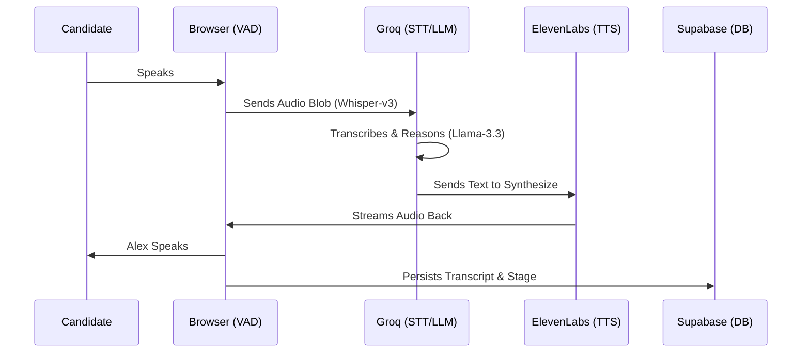

# HireFlow: The Future of Autonomous Technical Recruitment


> [!IMPORTANT]
> HireFlow is an advanced AI interview platform that replaces slow, inconsistent preliminary screenings with high-fidelity, voice-first autonomous assessments.

## 🌟 The Vision

HireFlow was born out of a simple observation: **Technical recruiting is broken.** Recruiters are overwhelmed, and candidates are frustrated by slow response times. HireFlow bridges this gap by providing "Alex"—a sophisticated AI interviewer that conducts deep technical dives 24/7, delivering objective, data-driven reports instantly.

---

## 📸 Experience the Interface

### 🖥️ Cinematic Landing

*Featuring a premium dark-mode aesthetic with an interactive, rounded 3D Rubik's cube centerpiece representing the complexity and clarity of thought.*

### 🎙️ The Interview Room

*A focused, minimalist environment designed to minimize candidate anxiety while maximizing technical signal. Features real-time Voice Activity Detection (VAD).*

### 📊 Comprehensive Evaluation

*Data-rich reports including weighted competency scores, percentile rankings, and AI-generated hiring recommendations.*

---

## ⚙️ How it Works (System Architecture)

HireFlow utilizes a unique **HTTP-Burst Architecture** to achieve sub-500ms latency without the overhead of persistent WebRTC rooms.



### 🧠 The "Alex" State Machine
Alex is not a simple chatbot; it is a **State-Aware Interviewer** that manages a structured 6-stage lifecycle:
1. **Introduction**: Rapport building and logistics.
2. **Academic Foundation**: Validating background.
3. **Technical Stack**: Deep-dive into specific tools and self-ratings.
4. **Problem Solving**: Probing architectural and logical thinking.
5. **Behavioral**: Assessing situational and cultural fit.
6. **Closing**: Seamless handover to the evaluation engine.

---

## 🛠️ The Powerhouse Tech Stack

- **Frontend Core**: [Next.js 16](https://nextjs.org/) (App Router) + [Vanilla CSS](https://developer.mozilla.org/en-US/docs/Web/CSS).
- **High-Speed Inference**: [Groq](https://groq.com/) using **Llama-3.3-70b** for reasoning and **Whisper-large-v3** for transcription.
- **Vocal Fidelity**: [ElevenLabs](https://elevenlabs.io/) with the **Aarav** persona for professional Indian English prosody.
- **Deep Intelligence**: [Google Gemini 1.5 Pro](https://ai.google.dev/) for high-context evaluation logic.
- **Data Persistence**: [Supabase](https://supabase.com/) (PostgreSQL) for secure, real-time data storage.

---

## ⚡ Quick Start

1. **Clone & Install**:
   ```bash
   git clone https://github.com/jyotirmya17/HireFlow.git
   cd hireflow
   npm install
   ```

2. **Environment Configuration**:
   ```bash
   cp .env.example .env.local
   ```
   > [!TIP]
   > Ensure you have valid keys for Groq, Gemini, and ElevenLabs to experience the low-latency voice pipeline.

3. **Launch the Engine**:
   ```bash
   npm run dev
   ```

---

## 🏗️ Future Roadmap

*   **[ ] Multi-modal Intelligence**: Real-time webcam analysis for eye-contact and sentiment scoring.
*   **[ ] Live Coding IDE**: A shared sandbox where Alex discusses code in real-time.
*   **[ ] Enterprise RAG**: Ingesting company-specific standards and JDs for hyper-relevant interviewing.

---

*Engineered with precision for the next generation of professional hiring.*
